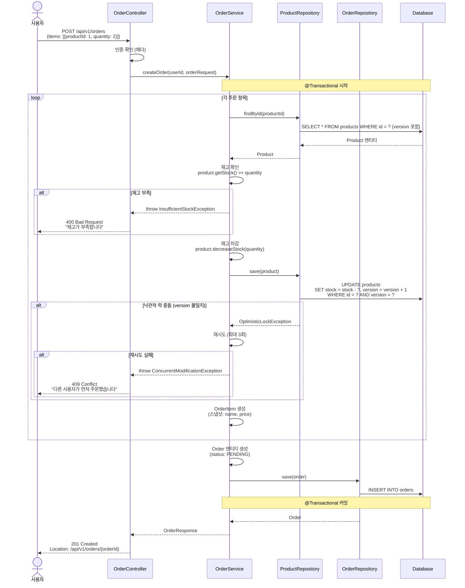
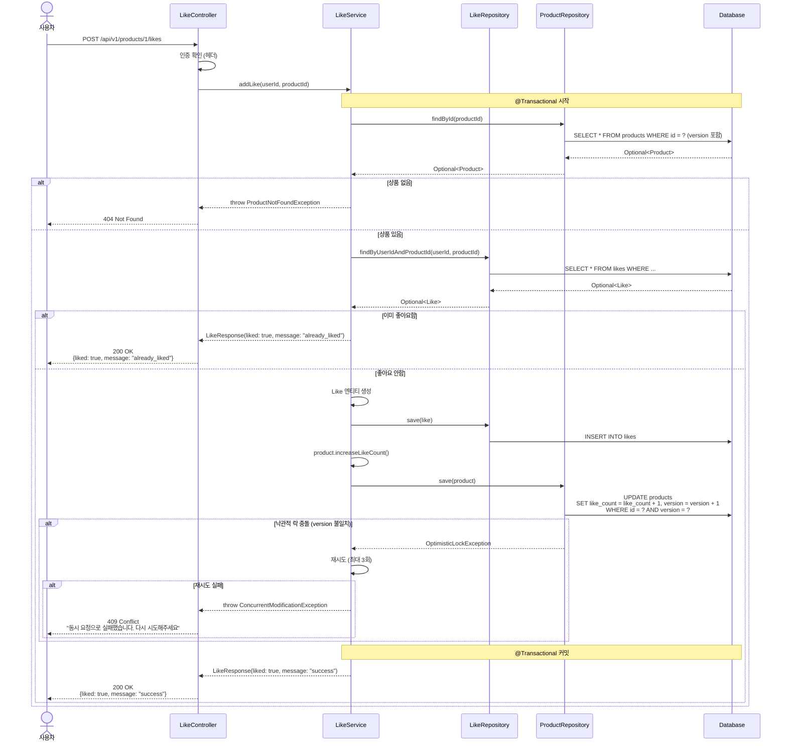
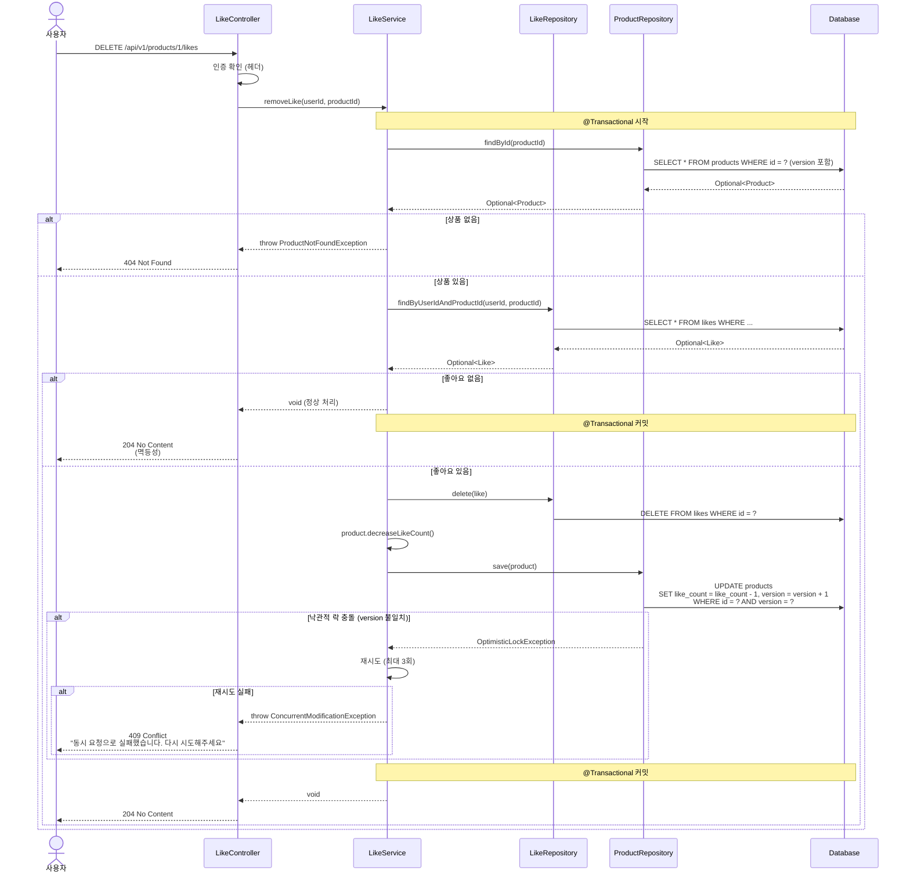
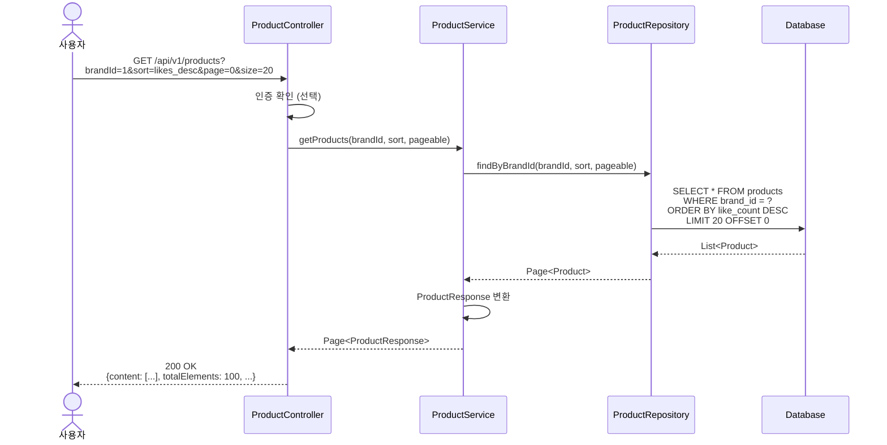
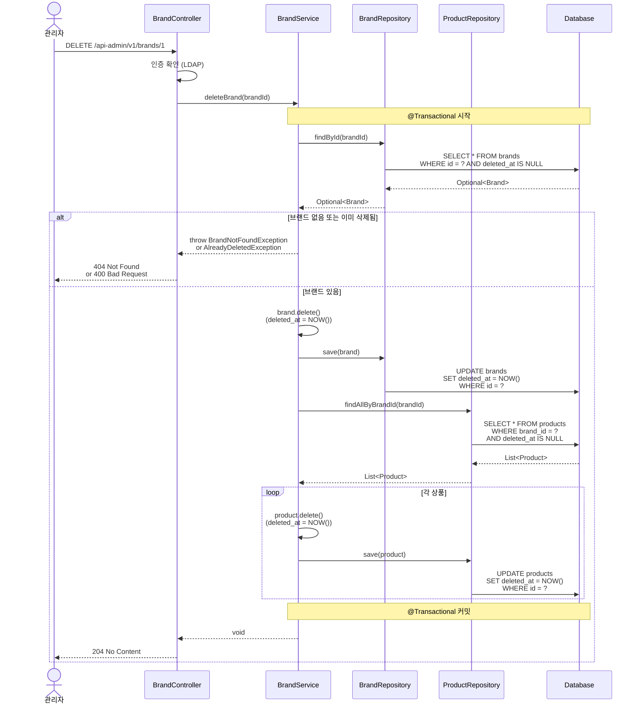
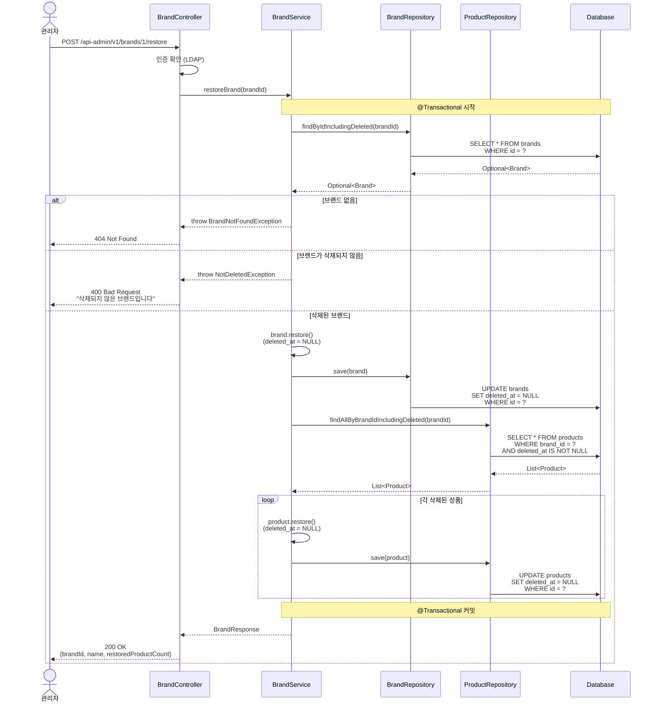
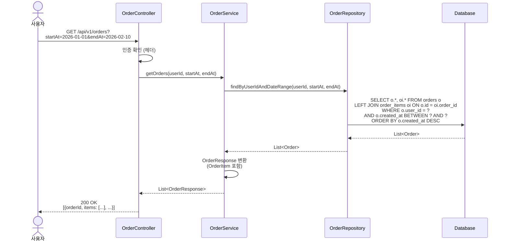
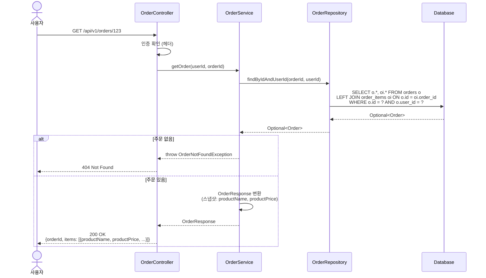

# 시퀀스 다이어그램

## 목적
이 문서는 주요 API 엔드포인트의 호출 흐름을 시퀀스 다이어그램으로 표현하여:
- **책임 분리**를 명확히 한다 (Controller, Service, Repository)
- **트랜잭션 경계**를 확인한다
- **호출 순서**와 의존 관계를 검증한다

---

## 1. 주문 생성 (POST /api/v1/orders)

### 목적
주문 생성 시 재고 차감과 주문 저장이 하나의 트랜잭션으로 처리되는지 검증

### 시퀀스 다이어그램



### 핵심 포인트
1. **낙관적 락 (@Version)**: 동시 주문 시 재고 정합성 보장, 충돌 시 재시도
2. **트랜잭션 범위**: 재고 차감 + 주문 저장이 하나의 트랜잭션
3. **스냅샷 저장**: OrderItem에 상품명/가격 저장 (Product 변경과 무관)
4. **실패 시 롤백**: 재고 부족 시 전체 롤백
5. **재시도 전략**: OptimisticLockException 발생 시 최대 3회 재시도

### 잠재 리스크
- **충돌 빈도**: 동일 상품에 동시 주문이 많으면 재시도 증가
- **재시도 비용**: 트랜잭션 롤백 후 재시도 오버헤드
- **선택지**:
  - A: 현재 구조 (낙관적 락) → 성능 좋음, 충돌 시 재시도 필요
  - B: 비관적 락으로 전환 → 락 대기 발생, 재시도 불필요
  - C: 선착순 상품만 비관적 락 → 상황별 최적화

---

## 2. 좋아요 등록 (POST /api/v1/products/{productId}/likes)

### 목적
좋아요 등록 시 중복 처리(멱등성)와 likeCount 증가가 원자적으로 처리되는지 검증

### 시퀀스 다이어그램



### 핵심 포인트
1. **토글 UX 지원**: `liked=false`면 POST, `liked=true`면 DELETE 호출
2. **멱등성**: 이미 좋아요한 경우 200 OK 반환 (에러 아님)
3. **원자적 업데이트**: Like 저장 + likeCount 증가가 하나의 트랜잭션
4. **낙관적 락 (@Version)**: likeCount 업데이트 시 동시성 제어, 충돌 시 재시도
5. **DB 제약조건**: likes 테이블에 UNIQUE(user_id, product_id) 인덱스
6. **재시도 전략**: OptimisticLockException 발생 시 최대 3회 재시도

### 잠재 리스크
- **충돌 빈도**: 인기 상품에서 동시 좋아요가 많으면 재시도 증가
- **재시도 비용**: Like INSERT는 성공했지만 likeCount 업데이트 실패 시 롤백
- **선택지**:
  - A: 현재 구조 (낙관적 락) → 성능 좋음, 충돌 시 재시도
  - B: 비관적 락으로 전환 → 락 대기 발생, 재시도 불필요
  - C: Redis 캐싱 (Phase 2) → 최고 성능, 인프라 복잡도 증가

---

## 3. 좋아요 취소 (DELETE /api/v1/products/{productId}/likes)

### 목적
좋아요 취소 시 멱등성과 likeCount 감소 처리 검증

### 시퀀스 다이어그램



### 핵심 포인트
1. **토글 UX 지원**: `liked=true` 상태에서 재클릭 시 DELETE 호출
2. **멱등성**: 좋아요가 없어도 204 No Content 반환 (에러 아님)
3. **음수 방지**: decreaseLikeCount()에서 0 미만 방지 로직 필요
4. **트랜잭션**: Like 삭제 + likeCount 감소가 하나의 트랜잭션
5. **낙관적 락 (@Version)**: likeCount 업데이트 시 동시성 제어, 충돌 시 재시도

---

## 4. 상품 목록 조회 (GET /api/v1/products)

### 목적
페이징과 정렬이 효율적으로 처리되는지 검증

### 시퀀스 다이어그램



### 핵심 포인트
1. **읽기 전용**: 트랜잭션 불필요 (또는 @Transactional(readOnly=true))
2. **인덱스 활용**: brand_id, like_count, created_at 컬럼 인덱스 필요
3. **페이징**: Spring Data JPA의 Pageable 활용

### 성능 최적화 고려사항
- **N+1 문제**: Brand 정보 포함 시 fetch join 필요
- **캐싱**: 인기 상품 목록은 Redis 캐싱 고려
- **쿼리 예시**:
  ```sql
  SELECT p.* FROM products p
  WHERE p.brand_id = ?
  ORDER BY p.like_count DESC
  LIMIT 20 OFFSET 0
  ```

---

## 5. 브랜드 Soft Delete (DELETE /api-admin/v1/brands/{brandId})

### 목적
브랜드 삭제 시 Soft Delete 처리 및 연관 상품 함께 soft delete 검증

### 시퀀스 다이어그램



### 핵심 포인트
1. **Soft Delete**: 물리 삭제가 아닌 `deleted_at` 컬럼 업데이트
2. **애플리케이션 CASCADE**: 브랜드 삭제 시 상품도 애플리케이션 레벨에서 soft delete
3. **트랜잭션**: 브랜드 + 모든 상품 soft delete가 하나의 트랜잭션
4. **복구 가능**: 데이터가 DB에 보존되어 복구 가능
5. **스냅샷 보존**: 주문은 `order_items` 스냅샷으로 조회 가능

### Soft Delete 장점
- **복구 용이**: 실수 삭제 시 복구 API로 되돌리기 가능
- **데이터 보존**: 법적/감사 요구사항 대응, 통계 분석 가능
- **운영 안전성**: Hard Delete의 돌이킬 수 없는 리스크 제거

### 잠재 리스크
- **대량 업데이트 비용**: 브랜드에 상품이 많으면 UPDATE 트랜잭션이 길어질 수 있음
- **쿼리 복잡도**: 모든 조회에 `deleted_at IS NULL` 조건 필요
- **UNIQUE 제약**: 삭제 후 동일 이름 재등록을 위해 `UNIQUE(name, deleted_at)` 필요

---

## 5-1. 브랜드 복구 (POST /api-admin/v1/brands/{brandId}/restore)

### 목적
삭제된 브랜드 복구 시 연관 상품도 함께 복구되는지 검증

### 시퀀스 다이어그램



### 핵심 포인트
1. **복구 로직**: `deleted_at`을 NULL로 설정
2. **애플리케이션 CASCADE**: 브랜드 복구 시 해당 브랜드의 모든 삭제된 상품도 함께 복구
3. **트랜잭션**: 브랜드 + 모든 상품 복구가 하나의 트랜잭션
4. **검증**: 삭제되지 않은 브랜드에 대한 복구 요청은 400 에러
5. **특별 쿼리**: 삭제된 항목 조회를 위한 `findByIdIncludingDeleted()` 사용

### 학습 포인트
- Soft Delete 환경에서는 삭제된 데이터 조회를 위한 별도 Repository 메서드 필요
- `@Where(clause = "deleted_at IS NULL")` 어노테이션을 우회하는 네이티브 쿼리 또는 `@SQLRestriction` 제외 쿼리 사용

---

## 6. 주문 목록 조회 (GET /api/v1/orders)

### 목적
유저별 주문 목록 조회 시 날짜 범위 필터링 확인

### 시퀀스 다이어그램



### 핵심 포인트
1. **Fetch Join**: OrderItem을 함께 조회하여 N+1 문제 방지
2. **날짜 인덱스**: created_at 컬럼에 인덱스 필요
3. **복합 인덱스**: (user_id, created_at) 복합 인덱스 고려

---

## 7. 단일 주문 상세 조회 (GET /api/v1/orders/{orderId})

### 목적
주문 상세 정보 조회 시 스냅샷 데이터 반환 확인

### 시퀀스 다이어그램



### 핵심 포인트
1. **스냅샷 데이터**: OrderItem에 저장된 상품명/가격 반환 (Product 테이블 조회 안함)
2. **권한 확인**: user_id로 본인 주문만 조회 가능
3. **관리자 조회**: 관리자 API는 모든 주문 조회 가능

---

## 8. 트랜잭션 경계 요약

| API | 트랜잭션 범위 | 락 전략 |
|-----|--------------|---------|
| **주문 생성** | 재고 차감 + 주문 저장 | 낙관적 락 (@Version, 재시도 3회) |
| **좋아요 등록** | Like 저장 + likeCount 증가 | 낙관적 락 (@Version, 재시도 3회) |
| **좋아요 취소** | Like 삭제 + likeCount 감소 | 낙관적 락 (@Version, 재시도 3회) |
| **브랜드 Soft Delete** | 브랜드 + 상품 soft delete (UPDATE) | 락 없음 (일반 업데이트) |
| **브랜드 복구** | 브랜드 + 상품 복구 (UPDATE) | 락 없음 (일반 업데이트) |
| **상품 Soft Delete** | 상품 soft delete (UPDATE) | 락 없음 (일반 업데이트) |
| **상품 복구** | 상품 복구 (UPDATE) | 락 없음 (일반 업데이트) |
| **상품 조회** | 읽기 전용 (트랜잭션 불필요) | 락 없음 |
| **주문 조회** | 읽기 전용 (트랜잭션 불필요) | 락 없음 |

---

## 9. 설계 검증 체크리스트

### 책임 분리
- [x] Controller: 요청/응답 변환, 인증 확인
- [x] Service: 비즈니스 로직, 트랜잭션 관리
- [x] Repository: 데이터 액세스

### 트랜잭션 일관성
- [x] 주문 생성 시 재고 차감 원자성 보장
- [x] 좋아요 등록/취소 시 카운트 동기화
- [x] 브랜드 삭제 시 상품 soft delete 처리 (애플리케이션 CASCADE)
- [x] 브랜드 복구 시 상품 복구 처리 (애플리케이션 CASCADE)

### 동시성 제어
- [x] 재고 차감 시 낙관적 락 사용 (@Version, 재시도 3회)
- [x] 좋아요 카운트 업데이트 시 낙관적 락 사용 (@Version, 재시도 3회)
- [x] 충돌 시 409 Conflict 응답
- [x] 데드락 위험 없음 (낙관적 락 사용)

### 멱등성
- [x] 좋아요 등록: 중복 시 200 OK
- [x] 좋아요 취소: 없어도 204 No Content

---

## 10. API 매칭 보완

요구사항 표에 있는 엔드포인트 중 본문 상세 다이어그램에서 다루지 않은 항목의 책임 흐름 요약:

1. `POST /api/v1/users`
   - `UserController -> UserService -> UserRepository`
   - 중복 loginId 검증 후 회원 생성
2. `GET /api/v1/users/me`
   - 헤더 인증 후 본인 User 조회
3. `PUT /api/v1/users/password`
   - 기존 비밀번호 검증 후 변경
4. `GET /api/v1/brands/{brandId}`
   - Brand 단건 조회, 없으면 404
5. `GET /api/v1/products/{productId}`
   - Product 단건 조회, 없으면 404
6. `GET /api/v1/users/{userId}/likes`
   - 인증 사용자와 `userId` 일치 검증 후 좋아요 목록 조회
7. `GET /api-admin/v1/brands?page=&size=`
   - LDAP 인증 후 브랜드 목록 페이징 조회
8. `GET /api-admin/v1/brands/{brandId}`
   - LDAP 인증 후 브랜드 상세 조회
9. `POST /api-admin/v1/brands`
   - LDAP 인증 후 브랜드 생성
10. `PUT /api-admin/v1/brands/{brandId}`
   - LDAP 인증 후 브랜드 수정
11. `GET /api-admin/v1/products?page=&size=&brandId=`
   - LDAP 인증 후 상품 목록 조회
12. `GET /api-admin/v1/products/{productId}`
   - LDAP 인증 후 상품 상세 조회
13. `POST /api-admin/v1/products`
   - LDAP 인증 후 브랜드 존재 검증 뒤 상품 생성
14. `PUT /api-admin/v1/products/{productId}`
   - LDAP 인증 후 상품 수정(브랜드 변경 불가)
15. `DELETE /api-admin/v1/products/{productId}`
   - LDAP 인증 후 상품 soft delete
16. `POST /api-admin/v1/brands/{brandId}/restore`
   - LDAP 인증 후 삭제된 브랜드 복구 (상품도 함께)
17. `POST /api-admin/v1/products/{productId}/restore`
   - LDAP 인증 후 삭제된 상품 복구
16. `GET /api-admin/v1/orders?page=&size=`
   - LDAP 인증 후 전체 주문 페이징 조회
17. `GET /api-admin/v1/orders/{orderId}`
   - LDAP 인증 후 주문 상세 조회
