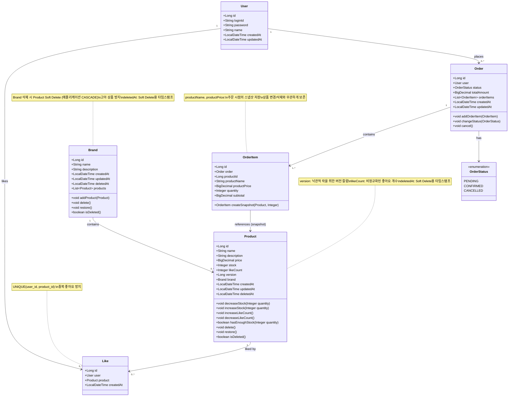
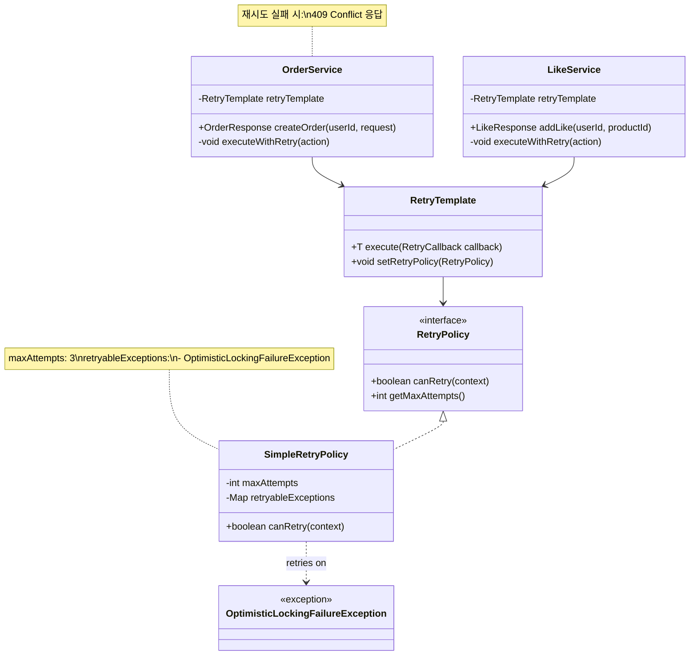

```mermaid
classDiagram
    %% Controller Layer
    class UserController {
        -UserService userService
        +ResponseEntity~UserResponse~ createUser(request)
        +ResponseEntity~UserResponse~ getMe(userId)
        +ResponseEntity~Void~ changePassword(userId, request)
    }

    class BrandController {
        -BrandService brandService
        +ResponseEntity~BrandResponse~ getBrand(brandId)
    }

    class AdminBrandController {
        -BrandService brandService
        +ResponseEntity~Page~BrandResponse~~ getBrands(pageable)
        +ResponseEntity~BrandResponse~ getBrand(brandId)
        +ResponseEntity~BrandResponse~ createBrand(request)
        +ResponseEntity~BrandResponse~ updateBrand(brandId, request)
        +ResponseEntity~Void~ deleteBrand(brandId)
    }

    class ProductController {
        -ProductService productService
        +ResponseEntity~Page~ProductResponse~~ getProducts(brandId, sort, pageable)
        +ResponseEntity~ProductResponse~ getProduct(productId)
    }

    class AdminProductController {
        -ProductService productService
        +ResponseEntity~Page~ProductResponse~~ getProducts(brandId, pageable)
        +ResponseEntity~ProductResponse~ getProduct(productId)
        +ResponseEntity~ProductResponse~ createProduct(request)
        +ResponseEntity~ProductResponse~ updateProduct(productId, request)
        +ResponseEntity~Void~ deleteProduct(productId)
    }

    class LikeController {
        -LikeService likeService
        +ResponseEntity~LikeResponse~ addLike(userId, productId)
        +ResponseEntity~Void~ removeLike(userId, productId)
        +ResponseEntity~Page~LikedProductResponse~~ getMyLikes(userId, pageable)
    }

    class OrderController {
        -OrderService orderService
        +ResponseEntity~OrderResponse~ createOrder(userId, request)
        +ResponseEntity~OrderResponse~ getOrder(userId, orderId)
        +ResponseEntity~List~OrderResponse~~ getOrders(userId, startAt, endAt)
    }

    class AdminOrderController {
        -OrderService orderService
        +ResponseEntity~Page~OrderResponse~~ getOrders(pageable)
        +ResponseEntity~OrderResponse~ getOrder(orderId)
    }

    %% Service Layer
    class UserService {
        -UserRepository userRepository
        +UserResponse createUser(request)
        +UserResponse getMe(userId)
        +void changePassword(userId, request)
    }

    class OrderService {
        -OrderRepository orderRepository
        -ProductRepository productRepository
        -RetryTemplate retryTemplate
        +OrderResponse createOrder(userId, request)
        +OrderResponse getOrder(userId, orderId)
        +List~OrderResponse~ getOrders(userId, startAt, endAt)
        +Page~OrderResponse~ getAdminOrders(pageable)
        +OrderResponse getAdminOrder(orderId)
        -Product findByIdWithRetry(productId)
    }

    class ProductService {
        -ProductRepository productRepository
        -BrandRepository brandRepository
        +Page~ProductResponse~ getProducts(brandId, sort, pageable)
        +ProductResponse getProduct(productId)
        +ProductResponse createProduct(request)
        +ProductResponse updateProduct(productId, request)
        +void deleteProduct(productId)
        +ProductResponse restoreProduct(productId)
        +Page~ProductResponse~ getAdminProducts(brandId, pageable)
        +ProductResponse getAdminProduct(productId)
    }

    class LikeService {
        -LikeRepository likeRepository
        -ProductRepository productRepository
        -RetryTemplate retryTemplate
        +LikeResponse addLike(userId, productId)
        +void removeLike(userId, productId)
        +Page~LikedProductResponse~ getMyLikes(userId, pageable)
        -void updateLikeCountWithRetry(Product, operation)
    }

    class BrandService {
        -BrandRepository brandRepository
        -ProductRepository productRepository
        +Page~BrandResponse~ getAdminBrands(pageable)
        +BrandResponse createBrand(request)
        +BrandResponse getBrand(brandId)
        +BrandResponse updateBrand(brandId, request)
        +void deleteBrand(brandId)
        +BrandResponse restoreBrand(brandId)
    }

    %% Repository Layer
    class UserRepository {
        <<interface>>
        +Optional~User~ findById(userId)
        +Optional~User~ findByLoginId(loginId)
        +User save(user)
    }

    class OrderRepository {
        <<interface>>
        +Optional~Order~ findByIdAndUserId(orderId, userId)
        +List~Order~ findByUserIdAndDateRange(userId, startAt, endAt)
        +Optional~Order~ findById(orderId)
        +Page~Order~ findAll(pageable)
        +Order save(order)
    }

    class ProductRepository {
        <<interface>>
        +Optional~Product~ findById(productId)
        +Optional~Product~ findByIdIncludingDeleted(productId)
        +List~Product~ findAllByBrandId(brandId)
        +List~Product~ findAllByBrandIdIncludingDeleted(brandId)
        +Page~Product~ findByBrandId(brandId, pageable)
        +Page~Product~ findAll(pageable)
        +Product save(product)
    }

    class LikeRepository {
        <<interface>>
        +Optional~Like~ findByUserIdAndProductId(userId, productId)
        +Page~Like~ findByUserId(userId, pageable)
        +Like save(like)
        +void delete(like)
    }

    class BrandRepository {
        <<interface>>
        +Optional~Brand~ findById(brandId)
        +Optional~Brand~ findByIdIncludingDeleted(brandId)
        +Page~Brand~ findAll(pageable)
        +Brand save(brand)
    }

    %% Dependencies
    UserController --> UserService
    BrandController --> BrandService
    AdminBrandController --> BrandService
    AdminProductController --> ProductService
    OrderController --> OrderService
    AdminOrderController --> OrderService
    ProductController --> ProductService
    LikeController --> LikeService

    UserService --> UserRepository
    OrderService --> OrderRepository
    OrderService --> ProductRepository
    ProductService --> ProductRepository
    ProductService --> BrandRepository
    LikeService --> LikeRepository
    LikeService --> ProductRepository
    BrandService --> BrandRepository
    BrandService --> ProductRepository

    note for OrderService "@Transactional\n@Retryable(OptimisticLockException)\n재시도 최대 3회"
    note for LikeService "@Transactional\n@Retryable(OptimisticLockException)\n재시도 최대 3회"
    note for BrandService "@Transactional\n브랜드 삭제 시 상품 Soft Delete (애플리케이션 CASCADE)\n복구 시 상품도 함께 복구"
```

# 클래스 다이어그램

## 목적
이 문서는 시스템의 구조를 클래스 다이어그램으로 표현하여:
- **도메인 책임**을 명확히 한다
- **의존 방향**을 검증한다 (Controller → Service → Repository → Entity)
- **응집도**를 확인한다 (관련 기능이 한 곳에 모여있는가)

---

## 1. 도메인 엔티티 다이어그램

### 목적
도메인 간 관계와 책임을 명확히 하여 영속성 구조와 비즈니스 로직 배치를 검증

### 다이어그램



### 핵심 포인트

1. **Product의 version 필드**
   - 낙관적 락(@Version) 구현을 위한 필드
   - 재고 차감, 좋아요 카운트 업데이트 시 동시성 제어

2. **OrderItem의 스냅샷 패턴**
   - `productId`는 참조 ID로만 저장 (FK 미적용)
   - `productName`, `productPrice`는 주문 시점 값을 별도 저장
   - 상품 정보 변경에 영향받지 않음

3. **Brand-Product Soft Delete CASCADE**
   - Brand 삭제 시 Product도 함께 Soft Delete
   - 애플리케이션 레벨에서 정합성 보장
   - 복구 시에도 함께 복구

4. **Like 중복 방지**
   - DB UNIQUE 제약: `UNIQUE(user_id, product_id)`
   - 멱등성 보장을 위한 비즈니스 로직과 이중 안전장치

5. **도메인 로직 배치**
   - Entity에 비즈니스 로직 포함 (DDD 스타일)
   - `decreaseStock()`, `increaseLikeCount()` 등
   - `delete()`, `restore()`, `isDeleted()`: Soft Delete 관리

---

## 2. 레이어 아키텍처 다이어그램

### 목적
Controller, Service, Repository 간 의존 방향과 책임 분리를 검증

### 다이어그램



### 핵심 포인트

1. **의존 방향 (단방향)**
   - Controller → Service → Repository
   - 역방향 의존 없음 (순환 참조 방지)

2. **Service 레이어의 책임**
   - 트랜잭션 관리 (`@Transactional`)
   - 낙관적 락 예외 재시도 로직 (`@Retryable` 또는 RetryTemplate)
   - 비즈니스 로직 조합

3. **Repository 레이어**
   - 데이터 액세스만 담당
   - Spring Data JPA 인터페이스
   - 비즈니스 로직 포함 안함
   - **Soft Delete 지원**: 기본 쿼리는 `deleted_at IS NULL` 조건 자동 적용
   - **복구용 메서드**: `findByIdIncludingDeleted()` 등 삭제된 항목 조회 메서드 별도 제공

4. **Controller 레이어**
   - 요청/응답 DTO 변환
   - 인증/인가 확인 (헤더 검증)
   - HTTP 상태 코드 결정

---

## 3. 재시도 전략 클래스 다이어그램

### 목적
낙관적 락 충돌 시 재시도 로직의 구조를 명확히 함

### 다이어그램



### 핵심 포인트

1. **Spring Retry 사용**
   - `RetryTemplate` 또는 `@Retryable` 어노테이션
   - 설정: 최대 3회 재시도

2. **재시도 대상 예외**
   - `OptimisticLockingFailureException` (JPA)
   - `ObjectOptimisticLockingFailureException` (Hibernate)

3. **재시도 실패 시 처리**
   - 3회 재시도 후에도 실패하면 `ConcurrentModificationException` 발생
   - Controller에서 409 Conflict 응답

---

## 4. 설계 의도 및 읽는 법

### 4.1 도메인 엔티티 다이어그램 읽기

**이 구조에서 특히 봐야 할 포인트**:

1. **Product의 이중 책임**
   - `stock` 관리 (주문 시 차감)
   - `likeCount` 관리 (좋아요 시 증가)
   - 두 필드 모두 `version`으로 동시성 제어
   - **잠재 리스크**: 좋아요와 주문이 동시에 발생하면 충돌 가능성 증가

2. **OrderItem의 스냅샷 패턴**
   - Product와의 관계가 "약한 참조"
   - `productId`는 FK 없이 보관 (고정 스냅샷 조회용)
   - 상품/브랜드 상태 변경 이후에도 주문 이력 보존 가능

3. **Like의 중간 테이블 역할**
   - User-Product 다대다 관계의 중간 테이블
   - `createdAt`만 있고 `updatedAt` 없음 (수정 불가, 생성/삭제만)

### 4.2 레이어 아키텍처 다이어그램 읽기

**의존 방향 검증**:
- 모든 화살표가 위에서 아래로 (Controller → Service → Repository)
- Service 간 의존 없음 (OrderService가 ProductService 호출 안함)
- **이유**: 트랜잭션 경계가 명확하고, 순환 참조 방지

**Service 레이어의 비대화 가능성**:
- OrderService가 ProductRepository를 직접 접근
- 나중에 Product 관련 로직이 복잡해지면 ProductService 호출로 변경 고려

---

## 5. 잠재 리스크 및 선택지

### 5.1 Product의 동시성 제어 범위

**현재 설계**:
- 하나의 `version`으로 `stock`과 `likeCount` 모두 관리
- 주문과 좋아요가 동시에 발생하면 충돌 증가

**선택지**:
- **A (현재 구조)**: 단일 version 사용
  - 장점: 구현 단순
  - 단점: 충돌 빈도 높음

- **B**: Product를 두 개로 분리
  ```java
  class Product {
      // stock, stockVersion
  }
  class ProductStatistics {
      // likeCount, statisticsVersion
  }
  ```
  - 장점: 충돌 격리
  - 단점: 복잡도 증가

- **C**: likeCount만 Redis로 이동 (Phase 2)
  - 장점: 충돌 완전 제거
  - 단점: 인프라 복잡도 증가

### 5.2 Service 간 의존 방지

**현재 설계**:
- OrderService가 ProductRepository 직접 사용
- LikeService가 ProductRepository 직접 사용

**이유**:
- 트랜잭션 경계를 Service 단위로 유지
- ProductService 호출 시 트랜잭션 전파 이슈 발생 가능

**향후 변경 시**:
- Product 비즈니스 로직이 복잡해지면 ProductDomainService 도입 고려
- Repository 접근은 각 Service가 독립적으로 수행

### 5.3 Soft Delete 구현 복잡도

**현재 설계**:
- Brand 삭제 시 Product도 함께 Soft Delete (애플리케이션 CASCADE)

**장점**:
- 실수 삭제 시 복구 가능
- 데이터 보존으로 법적/감사 요구사항 대응
- 운영 안전성 향상

**구현 복잡도**:
- 모든 Repository 쿼리에 `deleted_at IS NULL` 조건 추가 필요
- UNIQUE 제약 조정 필요: `UNIQUE(name, deleted_at)`
- 삭제된 데이터 조회용 별도 메서드 구현 필요

**학습 가치**:
- JPA `@SQLDelete`, `@Where`, `@SQLRestriction` 어노테이션 활용
- BaseEntity 패턴으로 공통 필드 관리
- 배치 작업으로 오래된 데이터 물리 삭제 (30일 경과)

---

## 6. 구현 체크리스트

### 도메인 모델
- [ ] Product 엔티티에 `@Version` 추가
- [ ] Product, Brand에 `deletedAt` 필드 추가
- [ ] Product, Brand에 `delete()`, `restore()`, `isDeleted()` 메서드 구현
- [ ] Product에 비즈니스 로직 메서드 구현 (decreaseStock, increaseLikeCount)
- [ ] OrderItem에 스냅샷 생성 메서드 구현 (createSnapshot)
- [ ] Like 테이블에 UNIQUE(user_id, product_id) 인덱스 추가
- [ ] OrderStatus enum 정의 (PENDING, CONFIRMED, CANCELLED)
- [ ] JPA `@SQLDelete`, `@Where` 어노테이션 적용 (Soft Delete)

### Service 레이어
- [ ] OrderService, LikeService에 재시도 로직 추가 (RetryTemplate 또는 @Retryable)
- [ ] OptimisticLockingFailureException 처리
- [ ] 재시도 3회 실패 시 ConcurrentModificationException 발생
- [ ] BrandService에 `restoreBrand()` 메서드 구현 (상품도 함께 복구)
- [ ] ProductService에 `restoreProduct()` 메서드 구현
- [ ] BrandService.deleteBrand()에서 연관 Product soft delete 처리

### Repository 레이어
- [ ] ProductRepository.findById() (deleted_at IS NULL 조건 자동)
- [ ] ProductRepository.findByIdIncludingDeleted() (복구용)
- [ ] ProductRepository.findAllByBrandId() (연관 상품 조회)
- [ ] ProductRepository.findAllByBrandIdIncludingDeleted() (복구용)
- [ ] BrandRepository.findById() (deleted_at IS NULL 조건 자동)
- [ ] BrandRepository.findByIdIncludingDeleted() (복구용)
- [ ] LikeRepository.findByUserIdAndProductId()
- [ ] OrderRepository.findByUserIdAndDateRange()

### Controller 레이어
- [ ] ConcurrentModificationException → 409 Conflict 처리
- [ ] 멱등성 응답 구현 (좋아요: 200 OK, 취소: 204 No Content)

