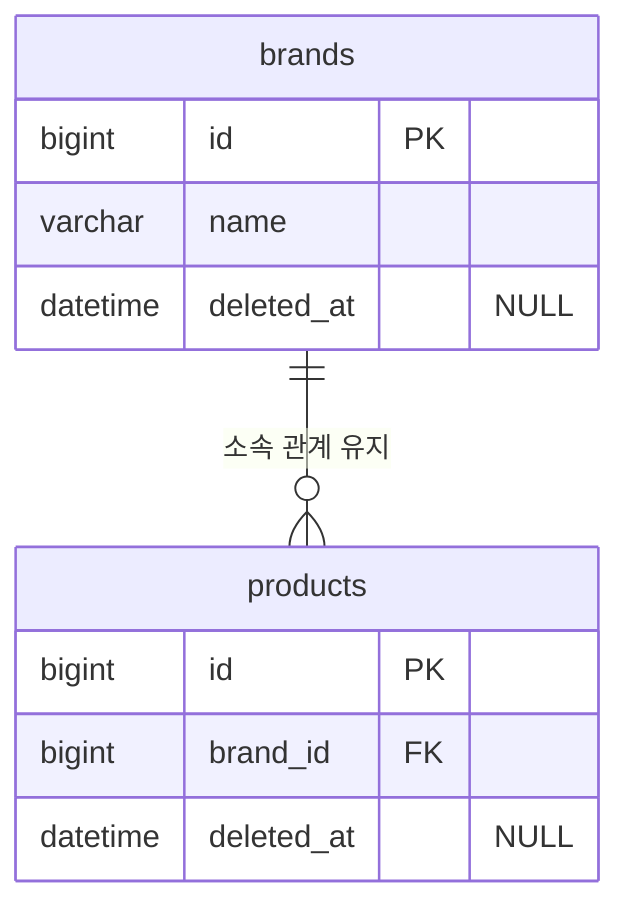
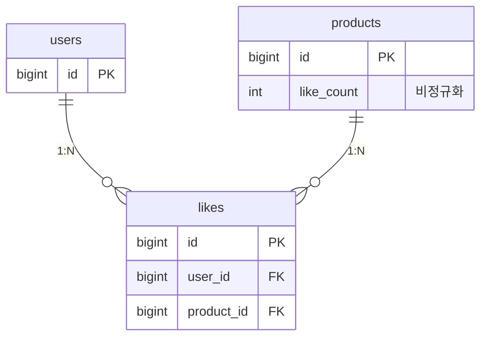
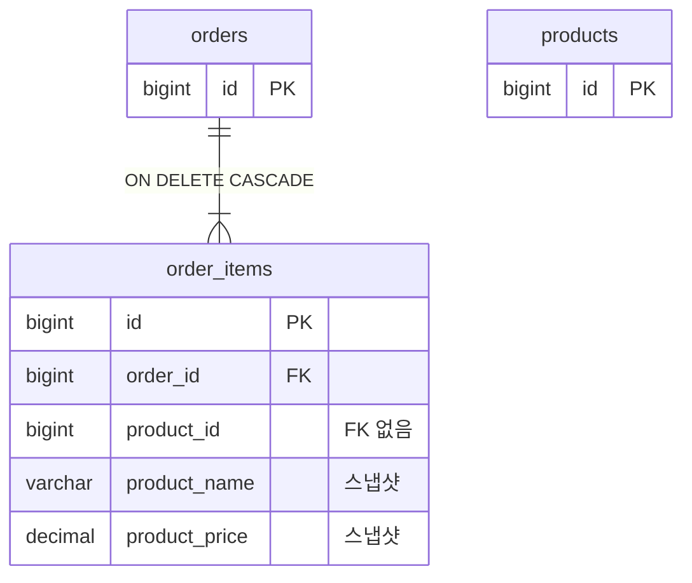
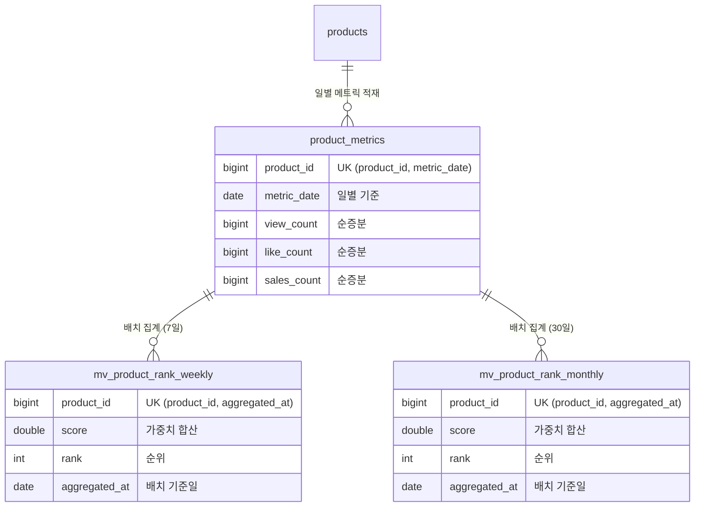

# ERD (Entity Relationship Diagram)

## 목적
이 문서는 데이터베이스 스키마를 ERD로 표현하여:
- **영속성 구조**를 명확히 한다
- **관계의 주인(FK 위치)**을 확인한다
- **정규화 여부**와 비정규화 전략을 검증한다
- **제약조건**(UNIQUE, CASCADE, CHECK)을 명시한다

---

## 1. 전체 ERD

### 목적
모든 엔티티 간 관계와 FK 배치를 한눈에 확인

### 다이어그램

```mermaid
erDiagram
    users ||--o{ likes : "creates"
    users ||--o{ orders : "places"

    brands ||--o{ products : "contains"

    products ||--o{ likes : "receives"
    products ||--o{ order_items : "referenced by"
    products ||--o{ product_metrics : "measured by"
    products ||--o{ mv_product_rank_weekly : "ranked in"
    products ||--o{ mv_product_rank_monthly : "ranked in"

    orders ||--|{ order_items : "contains"

    users {
        bigint id PK "AUTO_INCREMENT"
        varchar(50) login_id UK "NOT NULL"
        varchar(255) password "NOT NULL, BCrypt"
        varchar(100) name "NOT NULL"
        datetime created_at "NOT NULL"
        datetime updated_at "NOT NULL"
    }

    brands {
        bigint id PK "AUTO_INCREMENT"
        varchar(100) name "NOT NULL"
        text description "NULL"
        datetime created_at "NOT NULL"
        datetime updated_at "NOT NULL"
        datetime deleted_at "NULL, Soft Delete"
    }

    products {
        bigint id PK "AUTO_INCREMENT"
        bigint brand_id FK "NOT NULL"
        varchar(200) name "NOT NULL"
        text description "NULL"
        decimal(19,2) price "NOT NULL, CHECK >= 0"
        int stock "NOT NULL, DEFAULT 0, CHECK >= 0"
        int like_count "NOT NULL, DEFAULT 0, CHECK >= 0"
        bigint version "NOT NULL, DEFAULT 0, 낙관적 락"
        datetime created_at "NOT NULL"
        datetime updated_at "NOT NULL"
        datetime deleted_at "NULL, Soft Delete"
    }

    likes {
        bigint id PK "AUTO_INCREMENT"
        bigint user_id FK "NOT NULL"
        bigint product_id FK "NOT NULL"
        datetime created_at "NOT NULL"
    }

    orders {
        bigint id PK "AUTO_INCREMENT"
        bigint user_id FK "NOT NULL"
        varchar(20) status "NOT NULL, ENUM"
        decimal(19,2) total_amount "NOT NULL, CHECK >= 0"
        datetime created_at "NOT NULL"
        datetime updated_at "NOT NULL"
    }

    order_items {
        bigint id PK "AUTO_INCREMENT"
        bigint order_id FK "NOT NULL, ON DELETE CASCADE"
        bigint product_id "NOT NULL, 스냅샷용 참조"
        varchar(200) product_name "NOT NULL, 스냅샷"
        decimal(19,2) product_price "NOT NULL, 스냅샷, CHECK >= 0"
        int quantity "NOT NULL, CHECK > 0"
        decimal(19,2) subtotal "NOT NULL, CHECK >= 0"
    }

    product_metrics {
        bigint id PK "AUTO_INCREMENT"
        bigint product_id "NOT NULL"
        date metric_date "NOT NULL"
        bigint view_count "NOT NULL, DEFAULT 0"
        bigint like_count "NOT NULL, DEFAULT 0"
        bigint sales_count "NOT NULL, DEFAULT 0"
        decimal(19,2) latest_price "NULL"
        datetime price_updated_at "NULL"
    }

    mv_product_rank_weekly {
        bigint id PK "AUTO_INCREMENT"
        bigint product_id "NOT NULL"
        double score "NOT NULL"
        int rank "NOT NULL"
        bigint view_count "NOT NULL"
        bigint like_count "NOT NULL"
        bigint sales_count "NOT NULL"
        date aggregated_at "NOT NULL, 배치 실행 기준일"
    }

    mv_product_rank_monthly {
        bigint id PK "AUTO_INCREMENT"
        bigint product_id "NOT NULL"
        double score "NOT NULL"
        int rank "NOT NULL"
        bigint view_count "NOT NULL"
        bigint like_count "NOT NULL"
        bigint sales_count "NOT NULL"
        date aggregated_at "NOT NULL, 배치 실행 기준일"
    }
```

### 핵심 포인트

1. **관계의 주인 (FK 위치)**
   - `products.brand_id` → brands (N:1)
   - `likes.user_id` → users (N:1)
   - `likes.product_id` → products (N:1)
   - `orders.user_id` → users (N:1)
   - `order_items.order_id` → orders (N:1)
   - `order_items.product_id` → products (참조 ID만 저장, FK 미적용)

2. **삭제 전략 (Soft Delete)**
   - `brands.deleted_at`: 브랜드 Soft Delete (애플리케이션에서 연관 상품도 처리)
   - `products.deleted_at`: 상품 Soft Delete
   - `likes.product_id ON DELETE CASCADE`: 상품 물리 삭제 시 좋아요 자동 삭제 (Soft Delete에는 영향 없음)
   - `order_items.order_id ON DELETE CASCADE`: 주문 물리 삭제 시 항목 정리

3. **비정규화 필드**
   - `products.like_count`: 성능을 위한 비정규화 (집계 결과 저장)
   - `order_items.product_name, product_price`: 스냅샷 저장 (정규화 위반)

4. **낙관적 락**
   - `products.version`: JPA @Version 어노테이션 매핑

---

## 2. 테이블별 상세 정의

### 2.1 users (이미 구현 완료)

```sql
CREATE TABLE users (
    id BIGINT AUTO_INCREMENT PRIMARY KEY,
    login_id VARCHAR(50) NOT NULL UNIQUE,
    password VARCHAR(255) NOT NULL COMMENT 'BCrypt 암호화',
    name VARCHAR(100) NOT NULL,
    created_at DATETIME NOT NULL DEFAULT CURRENT_TIMESTAMP,
    updated_at DATETIME NOT NULL DEFAULT CURRENT_TIMESTAMP ON UPDATE CURRENT_TIMESTAMP,

    INDEX idx_login_id (login_id)
) ENGINE=InnoDB DEFAULT CHARSET=utf8mb4 COLLATE=utf8mb4_unicode_ci;
```

**컬럼 설명**:
- `login_id`: 로그인 ID, UNIQUE 제약으로 중복 방지
- `password`: BCrypt 해시 (길이 255 필요)
- `name`: 사용자 이름

---

### 2.2 brands

```sql
CREATE TABLE brands (
    id BIGINT AUTO_INCREMENT PRIMARY KEY,
    name VARCHAR(100) NOT NULL,
    description TEXT NULL,
    created_at DATETIME NOT NULL DEFAULT CURRENT_TIMESTAMP,
    updated_at DATETIME NOT NULL DEFAULT CURRENT_TIMESTAMP ON UPDATE CURRENT_TIMESTAMP,
    deleted_at DATETIME NULL COMMENT 'Soft Delete 타임스탬프',

    UNIQUE KEY uk_name_deleted (name, deleted_at) COMMENT '삭제된 브랜드는 동일 이름 재등록 가능',
    INDEX idx_deleted_at (deleted_at)
) ENGINE=InnoDB DEFAULT CHARSET=utf8mb4 COLLATE=utf8mb4_unicode_ci;
```

**컬럼 설명**:
- `name`: 브랜드명
- `description`: 브랜드 설명 (선택)
- `deleted_at`: Soft Delete 타임스탬프 (NULL이면 활성 상태)

**제약조건**:
- `UNIQUE(name, deleted_at)`: 활성 브랜드는 이름 중복 불가, 삭제된 브랜드는 재등록 가능
  - MySQL에서 NULL은 UNIQUE 제약에서 서로 다른 값으로 취급되어 동일 이름 재등록 가능

---

### 2.3 products

```sql
CREATE TABLE products (
    id BIGINT AUTO_INCREMENT PRIMARY KEY,
    brand_id BIGINT NOT NULL,
    name VARCHAR(200) NOT NULL,
    description TEXT NULL,
    price DECIMAL(19, 2) NOT NULL CHECK (price >= 0),
    stock INT NOT NULL DEFAULT 0 CHECK (stock >= 0),
    like_count INT NOT NULL DEFAULT 0 CHECK (like_count >= 0),
    version BIGINT NOT NULL DEFAULT 0 COMMENT '낙관적 락 버전',
    created_at DATETIME NOT NULL DEFAULT CURRENT_TIMESTAMP,
    updated_at DATETIME NOT NULL DEFAULT CURRENT_TIMESTAMP ON UPDATE CURRENT_TIMESTAMP,
    deleted_at DATETIME NULL COMMENT 'Soft Delete 타임스탬프',

    CONSTRAINT fk_products_brand FOREIGN KEY (brand_id)
        REFERENCES brands(id),

    INDEX idx_brand_id (brand_id),
    INDEX idx_deleted_at (deleted_at),
    INDEX idx_created_at (created_at),
    INDEX idx_like_count (like_count),
    INDEX idx_price (price),
    INDEX idx_brand_deleted (brand_id, deleted_at) COMMENT '브랜드별 활성 상품 조회',
    INDEX idx_brand_like (brand_id, like_count DESC, deleted_at) COMMENT '브랜드별 좋아요순 정렬',
    INDEX idx_brand_created (brand_id, created_at DESC, deleted_at) COMMENT '브랜드별 최신순 정렬',
    INDEX idx_brand_price (brand_id, price ASC, deleted_at) COMMENT '브랜드별 가격순 정렬'
) ENGINE=InnoDB DEFAULT CHARSET=utf8mb4 COLLATE=utf8mb4_unicode_ci;
```

**컬럼 설명**:
- `brand_id`: Brand FK (CASCADE 제거)
- `price`: 상품 가격 (DECIMAL 19,2 = 최대 17자리 정수 + 소수점 2자리)
- `stock`: 재고 수량, 0 이상
- `like_count`: 좋아요 개수 (비정규화), 0 이상
- `version`: 낙관적 락 버전 (JPA @Version 매핑)
- `deleted_at`: Soft Delete 타임스탬프 (NULL이면 활성 상태)

**제약조건**:
- `CHECK (price >= 0)`: 음수 가격 방지
- `CHECK (stock >= 0)`: 음수 재고 방지
- `CHECK (like_count >= 0)`: 음수 좋아요 방지
- FK에 CASCADE 없음: Soft Delete는 애플리케이션 레벨에서 처리

**인덱스 전략**:
- `idx_brand_id`: Brand별 상품 조회
- `idx_deleted_at`: Soft Delete 필터링
- `idx_created_at`: 최신순 정렬
- `idx_like_count`: 좋아요순 정렬
- `idx_price`: 가격순 정렬
- `idx_brand_deleted`: Brand별 활성 상품 조회 최적화
- `idx_brand_like`: Brand별 좋아요순 + deleted_at 포함
- `idx_brand_created`: Brand별 최신순 + deleted_at 포함
- `idx_brand_price`: Brand별 가격순 + deleted_at 포함

**Soft Delete 인덱스 설계**:
- 복합 인덱스에 `deleted_at` 컬럼 추가하여 `WHERE deleted_at IS NULL` 조건 최적화
- `idx_brand_deleted` 인덱스로 브랜드별 활성 상품 조회 성능 향상

---

### 2.4 likes

```sql
CREATE TABLE likes (
    id BIGINT AUTO_INCREMENT PRIMARY KEY,
    user_id BIGINT NOT NULL,
    product_id BIGINT NOT NULL,
    created_at DATETIME NOT NULL DEFAULT CURRENT_TIMESTAMP,

    CONSTRAINT fk_likes_user FOREIGN KEY (user_id)
        REFERENCES users(id) ON DELETE CASCADE,
    CONSTRAINT fk_likes_product FOREIGN KEY (product_id)
        REFERENCES products(id) ON DELETE CASCADE,

    UNIQUE KEY uk_user_product (user_id, product_id) COMMENT '중복 좋아요 방지',
    INDEX idx_product_id (product_id),
    INDEX idx_created_at (created_at)
) ENGINE=InnoDB DEFAULT CHARSET=utf8mb4 COLLATE=utf8mb4_unicode_ci;
```

**컬럼 설명**:
- `user_id`: User FK
- `product_id`: Product FK
- `created_at`: 좋아요 생성 시각 (updatedAt 없음, 수정 불가)

**제약조건**:
- `UNIQUE(user_id, product_id)`: 동일 사용자가 같은 상품에 중복 좋아요 방지
- `ON DELETE CASCADE` (user): 사용자 물리 삭제 시 Like 정리
- `ON DELETE CASCADE` (product): 상품 물리 삭제 시 Like 정리

**인덱스 전략**:
- `uk_user_product`: 멱등성 보장 + 조회 최적화
- `idx_product_id`: 상품별 좋아요 목록 조회

---

### 2.5 orders

```sql
CREATE TABLE orders (
    id BIGINT AUTO_INCREMENT PRIMARY KEY,
    user_id BIGINT NOT NULL,
    status VARCHAR(20) NOT NULL
        CHECK (status IN ('PENDING', 'CONFIRMED', 'CANCELLED')),
    total_amount DECIMAL(19, 2) NOT NULL CHECK (total_amount >= 0),
    created_at DATETIME NOT NULL DEFAULT CURRENT_TIMESTAMP,
    updated_at DATETIME NOT NULL DEFAULT CURRENT_TIMESTAMP ON UPDATE CURRENT_TIMESTAMP,

    CONSTRAINT fk_orders_user FOREIGN KEY (user_id)
        REFERENCES users(id) ON DELETE RESTRICT,

    INDEX idx_user_id (user_id),
    INDEX idx_created_at (created_at),
    INDEX idx_user_created (user_id, created_at DESC) COMMENT '사용자별 주문 목록 조회'
) ENGINE=InnoDB DEFAULT CHARSET=utf8mb4 COLLATE=utf8mb4_unicode_ci;
```

**컬럼 설명**:
- `user_id`: User FK
- `status`: 주문 상태 (PENDING, CONFIRMED, CANCELLED)
- `total_amount`: 총 주문 금액

**제약조건**:
- `CHECK (status IN ...)`: 유효한 상태값만 허용
- `CHECK (total_amount >= 0)`: 음수 금액 방지
- `ON DELETE RESTRICT`: User 삭제 시 주문 이력 보존 (삭제 불가)

**인덱스 전략**:
- `idx_user_id`: 사용자별 주문 조회
- `idx_created_at`: 날짜 범위 검색
- `idx_user_created`: 복합 인덱스 (사용자별 최신 주문)

---

### 2.6 order_items

```sql
CREATE TABLE order_items (
    id BIGINT AUTO_INCREMENT PRIMARY KEY,
    order_id BIGINT NOT NULL,
    product_id BIGINT NOT NULL COMMENT '스냅샷용 참조, FK 제약 없음',
    product_name VARCHAR(200) NOT NULL COMMENT '주문 시점 상품명 스냅샷',
    product_price DECIMAL(19, 2) NOT NULL COMMENT '주문 시점 가격 스냅샷'
        CHECK (product_price >= 0),
    quantity INT NOT NULL CHECK (quantity > 0),
    subtotal DECIMAL(19, 2) NOT NULL CHECK (subtotal >= 0),

    CONSTRAINT fk_order_items_order FOREIGN KEY (order_id)
        REFERENCES orders(id) ON DELETE CASCADE,

    INDEX idx_order_id (order_id),
    INDEX idx_product_id (product_id)
) ENGINE=InnoDB DEFAULT CHARSET=utf8mb4 COLLATE=utf8mb4_unicode_ci;
```

**컬럼 설명**:
- `order_id`: Order FK, ON DELETE CASCADE
- `product_id`: Product 참조 (FK 제약 없음, 스냅샷용)
- `product_name`: 주문 시점 상품명 (스냅샷)
- `product_price`: 주문 시점 가격 (스냅샷)
- `quantity`: 주문 수량
- `subtotal`: 소계 (product_price * quantity)

**스냅샷 패턴**:
- `product_id`는 있지만 **FK 제약 없음** (선택사항)
- 이유: Product 정보 변경/삭제 정책과 무관하게 주문 이력 보존
- `product_name`, `product_price`는 주문 시점 값 저장

**제약조건**:
- `CHECK (quantity > 0)`: 0개 주문 방지
- `CHECK (subtotal >= 0)`: 음수 금액 방지
- `ON DELETE CASCADE`: Order 삭제 시 OrderItem도 삭제

**인덱스 전략**:
- `idx_order_id`: 주문별 항목 조회
- `idx_product_id`: 상품별 판매 이력 조회 (통계용)

---

## 3. 관계 상세 분석

### 3.1 Brand → Product (1:N, Soft Delete + 애플리케이션 CASCADE)



**설계 의도 (Soft Delete)**:
- Brand 삭제 시 `deleted_at` 업데이트 (물리 삭제 아님)
- 애플리케이션 레벨에서 연관 Product도 함께 soft delete 처리
- 데이터는 DB에 보존되며, 조회 시 `deleted_at IS NULL` 조건으로 제외

**장점**:
- 운영자 실수 삭제 시 복구 가능
- 데이터 보존으로 법적/감사 요구사항 대응
- 통계 및 분석에 삭제된 데이터 활용 가능

**구현 방식**:
- JPA `@SQLDelete`, `@Where` 어노테이션으로 자동화
- BrandService에서 Brand 삭제 시 연관 Product를 조회하여 함께 soft delete
- 복구 시에도 Brand와 Product 함께 복구

---

### 3.2 User ← → Product (N:M via likes)



**설계 의도**:
- 다대다 관계를 likes 중간 테이블로 해소
- `products.like_count` 비정규화로 성능 최적화

**정규화 vs 비정규화**:
- 정규화: `SELECT COUNT(*) FROM likes WHERE product_id = ?`
- 비정규화: `SELECT like_count FROM products WHERE id = ?`
- 트레이드오프: 쓰기 복잡도 증가 ↔ 읽기 성능 향상

---

### 3.3 Order → OrderItem (1:N, CASCADE)



**설계 의도**:
- OrderItem은 Product를 "약하게 참조"
- FK 제약 없이 product_id만 저장 (선택)
- 상품 상태 변경/물리 삭제 이후에도 주문 이력 보존

**스냅샷 이유**:
- 법적 증빙: 주문 시점 가격 보존
- 정산: 가격 변경과 무관하게 계산
- 감사: 과거 거래 내역 추적

---

## 4. 제약조건 및 인덱스 전략

### 4.1 UNIQUE 제약

| 테이블 | 컬럼 | 이유 |
|--------|------|------|
| users | login_id | 로그인 ID 중복 방지 |
| brands | name | 브랜드명 중복 방지 |
| likes | (user_id, product_id) | 중복 좋아요 방지, 멱등성 보장 |

### 4.2 CHECK 제약

| 테이블 | 컬럼 | 제약 | 이유 |
|--------|------|------|------|
| products | price | >= 0 | 음수 가격 방지 |
| products | stock | >= 0 | 음수 재고 방지 |
| products | like_count | >= 0 | 음수 좋아요 방지 |
| orders | total_amount | >= 0 | 음수 금액 방지 |
| orders | status | IN ('PENDING', 'CONFIRMED', 'CANCELLED') | 유효한 상태만 허용 |
| order_items | quantity | > 0 | 0개 주문 방지 |

### 4.3 삭제/보존 전략

| 대상 | 정책 | 이유 |
|------|------|------|
| brands | Soft Delete | 관리자 실수 삭제 시 복구 가능, 데이터 보존 |
| products | Soft Delete | 상품 삭제 후 복구 가능, 통계 분석 활용 |
| products.brand_id FK | 애플리케이션 CASCADE | 브랜드 삭제 시 상품도 애플리케이션에서 soft delete |
| likes.user_id FK | ON DELETE CASCADE | 사용자 물리 삭제 시 Like 정리 |
| likes.product_id FK | ON DELETE CASCADE | 상품 물리 삭제 시 Like 정리 (Soft Delete에는 영향 없음) |
| order_items.order_id FK | ON DELETE CASCADE | 주문 물리 삭제 시 항목 정리 |
| orders.user_id FK | ON DELETE RESTRICT | 사용자 삭제 시 주문 이력 보존 |

### 4.4 인덱스 전략

#### 단일 인덱스
```sql
-- 상품 조회
CREATE INDEX idx_brand_id ON products(brand_id);
CREATE INDEX idx_created_at ON products(created_at);
CREATE INDEX idx_like_count ON products(like_count);
CREATE INDEX idx_price ON products(price);

-- 주문 조회
CREATE INDEX idx_user_id ON orders(user_id);
CREATE INDEX idx_created_at ON orders(created_at);
```

#### 복합 인덱스 (정렬 최적화 + Soft Delete)
```sql
-- 브랜드별 활성 상품 조회
CREATE INDEX idx_brand_deleted ON products(brand_id, deleted_at);

-- 브랜드별 좋아요순 정렬 (Soft Delete 지원)
CREATE INDEX idx_brand_like ON products(brand_id, like_count DESC, deleted_at);

-- 브랜드별 최신순 정렬 (Soft Delete 지원)
CREATE INDEX idx_brand_created ON products(brand_id, created_at DESC, deleted_at);

-- 브랜드별 가격순 정렬 (Soft Delete 지원)
CREATE INDEX idx_brand_price ON products(brand_id, price ASC, deleted_at);

-- 사용자별 최신 주문
CREATE INDEX idx_user_created ON orders(user_id, created_at DESC);

-- 좋아요 멱등성 검사 (이미 UNIQUE로 커버)
-- UNIQUE KEY uk_user_product ON likes(user_id, product_id);
```

**복합 인덱스 효과 (Soft Delete 포함)**:
```sql
-- 브랜드별 활성 상품만 좋아요순 정렬
SELECT * FROM products
WHERE brand_id = 1 AND deleted_at IS NULL
ORDER BY like_count DESC
LIMIT 20;

-- idx_brand_like 인덱스 사용: (brand_id, like_count DESC, deleted_at)
-- WHERE절의 brand_id, deleted_at 조건과 ORDER BY의 like_count 모두 인덱스 활용
```

---

## 5. 정규화 분석

### 5.1 비정규화 필드

| 테이블 | 컬럼 | 원본 | 이유 |
|--------|------|------|------|
| products | like_count | COUNT(*) FROM likes | 읽기 성능 (정렬 쿼리) |
| order_items | product_name | products.name | 스냅샷 (법적 증빙) |
| order_items | product_price | products.price | 스냅샷 (정산) |

### 5.2 정규형 준수 여부

- **1NF (제1정규형)**: ✅ 모든 속성이 원자값
- **2NF (제2정규형)**: ✅ 부분 함수 종속 없음
- **3NF (제3정규형)**: ⚠️ **의도적 위반**
  - `products.like_count`는 이행적 함수 종속 (likes 테이블에서 계산 가능)
  - `order_items.product_name, product_price`는 products 테이블과 중복

**비정규화 선택 이유**:
- **성능**: 좋아요 수로 정렬 시 COUNT(*) 집계 비용 제거
- **법적 요구사항**: 주문 시점 정보 보존 (가격 변경과 무관)
- **트레이드오프**: 쓰기 복잡도 증가 ↔ 읽기 성능 향상

---

## 6. 동시성 제어 전략

### 6.1 낙관적 락 (products.version)

```sql
-- JPA @Version 매핑
UPDATE products
SET stock = stock - ?,
    version = version + 1,
    updated_at = NOW()
WHERE id = ? AND version = ?;

-- 영향받은 행이 0이면 OptimisticLockException 발생
```

**적용 대상**:
- 재고 차감 (`stock`)
- 좋아요 카운트 업데이트 (`like_count`)

**장점**:
- 락 대기 없음
- 높은 처리량

**단점**:
- 충돌 시 재시도 필요 (최대 3회)
- 재시도 실패 시 409 Conflict

---

## 7. 데이터 타입 선택 근거

### 7.1 숫자형

| 컬럼 | 타입 | 이유 |
|------|------|------|
| id | BIGINT | 최대 9,223,372,036,854,775,807 (92경) |
| price, total_amount, subtotal | DECIMAL(19,2) | 금액은 부동소수점 오차 방지 |
| stock, like_count, quantity | INT | 최대 2,147,483,647 (21억) |
| version | BIGINT | 버전 번호 오버플로우 방지 |

**DECIMAL vs FLOAT**:
- DECIMAL: 정확한 값 (금액 계산 필수)
- FLOAT: 근사값 (통계, 과학 계산)

### 7.2 문자형

| 컬럼 | 타입 | 이유 |
|------|------|------|
| login_id | VARCHAR(50) | 로그인 ID 길이 제한 |
| password | VARCHAR(255) | BCrypt 해시 길이 (60자 + 여유) |
| name | VARCHAR(100) | 사용자/브랜드 이름 |
| product_name | VARCHAR(200) | 상품명 길이 |
| status | VARCHAR(20) | ENUM 문자열 |
| description | TEXT | 긴 설명 (65,535자) |

### 7.3 날짜형

| 컬럼 | 타입 | 이유 |
|------|------|------|
| created_at | DATETIME | 생성 시각 (밀리초 포함) |
| updated_at | DATETIME | 수정 시각 (자동 업데이트) |

**DATETIME vs TIMESTAMP**:
- DATETIME: 1000-01-01 ~ 9999-12-31 (시간대 무관)
- TIMESTAMP: 1970-01-01 ~ 2038-01-19 (시간대 변환)

---

## 8. 마이그레이션 순서

### 8.1 테이블 생성 순서 (FK 의존성)

```sql
-- 1. 독립 테이블 (FK 없음)
CREATE TABLE users (...);
CREATE TABLE brands (...);

-- 2. 1차 의존 테이블
CREATE TABLE products (...);  -- FK: brand_id
CREATE TABLE orders (...);    -- FK: user_id

-- 3. 2차 의존 테이블
CREATE TABLE likes (...);        -- FK: user_id, product_id
CREATE TABLE order_items (...);  -- FK: order_id
```

### 8.2 초기 데이터 (Seed Data)

```sql
-- 관리자 계정
INSERT INTO users (login_id, password, name)
VALUES ('admin', '$2a$10$...', 'Administrator');

-- 샘플 브랜드
INSERT INTO brands (name, description)
VALUES ('Samsung', '삼성전자'), ('Apple', '애플');

-- 샘플 상품
INSERT INTO products (brand_id, name, price, stock)
VALUES (1, 'Galaxy S25', 1200000, 100);
```

---

## 8. 랭킹/집계 테이블 (Round 9~10)

### 8.1 product_metrics (일별 상품 메트릭)

이 테이블은 Kafka 이벤트 소비 시 commerce-streamer가 적재하며, commerce-batch가 주간/월간 집계의 원본으로 읽는다.

```sql
CREATE TABLE product_metrics (
    id BIGINT AUTO_INCREMENT PRIMARY KEY,
    product_id BIGINT NOT NULL,
    metric_date DATE NOT NULL COMMENT '메트릭 기준 날짜',
    view_count BIGINT NOT NULL DEFAULT 0,
    like_count BIGINT NOT NULL DEFAULT 0,
    sales_count BIGINT NOT NULL DEFAULT 0,
    latest_price DECIMAL(19, 2) NULL,
    price_updated_at DATETIME NULL,

    UNIQUE KEY uk_product_date (product_id, metric_date),
    INDEX idx_metric_date (metric_date)
) ENGINE=InnoDB DEFAULT CHARSET=utf8mb4 COLLATE=utf8mb4_unicode_ci;
```

**컬럼 설명**:
- `product_id`: 상품 참조 (FK 미적용, streamer에서 적재)
- `metric_date`: 일별 스냅샷 기준 날짜
- `view_count`, `like_count`, `sales_count`: 해당 날짜의 순증분 (음수 가능)
- `latest_price`: 해당 날짜의 최종 가격
- `price_updated_at`: 가격 갱신 시각

**제약조건**:
- `UNIQUE(product_id, metric_date)`: 상품당 하루에 1행, UPSERT로 갱신

**배치 읽기 패턴**:
```sql
-- 주간 집계: 최근 7일
SELECT product_id, SUM(view_count), SUM(like_count), SUM(sales_count)
FROM product_metrics
WHERE metric_date BETWEEN DATE_SUB(:baseDate, INTERVAL 6 DAY) AND :baseDate
GROUP BY product_id

-- 월간 집계: 최근 30일
SELECT product_id, SUM(view_count), SUM(like_count), SUM(sales_count)
FROM product_metrics
WHERE metric_date BETWEEN DATE_SUB(:baseDate, INTERVAL 29 DAY) AND :baseDate
GROUP BY product_id
```

---

### 8.2 mv_product_rank_weekly (주간 랭킹 MV)

배치가 매일 갱신하는 조회 전용 Materialized View. 배치 실행 기준일로부터 최근 7일 집계.

```sql
CREATE TABLE mv_product_rank_weekly (
    id BIGINT AUTO_INCREMENT PRIMARY KEY,
    product_id BIGINT NOT NULL,
    score DOUBLE NOT NULL COMMENT '가중치 합산 점수',
    rank INT NOT NULL COMMENT '점수 기준 순위',
    view_count BIGINT NOT NULL DEFAULT 0,
    like_count BIGINT NOT NULL DEFAULT 0,
    sales_count BIGINT NOT NULL DEFAULT 0,
    aggregated_at DATE NOT NULL COMMENT '배치 실행 기준일',

    UNIQUE KEY uk_product_aggregated (product_id, aggregated_at),
    INDEX idx_aggregated_rank (aggregated_at, rank)
) ENGINE=InnoDB DEFAULT CHARSET=utf8mb4 COLLATE=utf8mb4_unicode_ci;
```

---

### 8.3 mv_product_rank_monthly (월간 랭킹 MV)

구조는 weekly와 동일. 최근 30일 집계.

```sql
CREATE TABLE mv_product_rank_monthly (
    id BIGINT AUTO_INCREMENT PRIMARY KEY,
    product_id BIGINT NOT NULL,
    score DOUBLE NOT NULL COMMENT '가중치 합산 점수',
    rank INT NOT NULL COMMENT '점수 기준 순위',
    view_count BIGINT NOT NULL DEFAULT 0,
    like_count BIGINT NOT NULL DEFAULT 0,
    sales_count BIGINT NOT NULL DEFAULT 0,
    aggregated_at DATE NOT NULL COMMENT '배치 실행 기준일',

    UNIQUE KEY uk_product_aggregated (product_id, aggregated_at),
    INDEX idx_aggregated_rank (aggregated_at, rank)
) ENGINE=InnoDB DEFAULT CHARSET=utf8mb4 COLLATE=utf8mb4_unicode_ci;
```

**점수 계산 공식** (일간 Redis ZSET과 동일):
```
score = view_count × 0.1 + like_count × 0.2 + sales_count × 0.7
```

**설계 의도**:
- MySQL에 MV 기능이 없으므로 **별도 테이블 + 배치 적재** 방식
- `aggregated_at`으로 배치 실행 기준일 기록, 이전 데이터와 구분
- `rank`를 미리 계산해 적재하여 API 조회 시 정렬 비용 제거
- TOP 100만 적재하여 테이블 크기 제한

**인덱스 전략**:
- `uk_product_aggregated`: 멱등 적재 보장 (동일 기준일 재실행 시 UPSERT)
- `idx_aggregated_rank`: API 조회 시 `WHERE aggregated_at = ? ORDER BY rank` 최적화

---

### 8.4 event_handled (이벤트 처리 기록)

Kafka 이벤트 멱등성 보장을 위한 테이블 (commerce-streamer).

```sql
CREATE TABLE event_handled (
    id BIGINT AUTO_INCREMENT PRIMARY KEY,
    topic VARCHAR(255) NOT NULL,
    event_id VARCHAR(255) NOT NULL,
    created_at DATETIME NOT NULL DEFAULT CURRENT_TIMESTAMP,

    UNIQUE KEY uk_topic_event (topic, event_id)
) ENGINE=InnoDB DEFAULT CHARSET=utf8mb4 COLLATE=utf8mb4_unicode_ci;
```

---

### 8.5 랭킹 시스템 관계도



**핵심 포인트**:
1. `product_metrics`는 streamer가 적재, batch가 읽기 전용으로 사용
2. MV 테이블은 batch가 적재, API가 읽기 전용으로 사용
3. 일간 랭킹은 Redis ZSET(`ranking:all:yyyyMMdd`)에서 직접 조회 (MV 미사용)

---

## 9. 백업 및 복구 전략

### 9.1 백업 우선순위

| 우선순위 | 테이블 | 이유 |
|----------|--------|------|
| 높음 | orders, order_items | 주문 이력 (법적 증빙) |
| 높음 | users | 사용자 정보 (복구 불가 시 치명적) |
| 중간 | products, brands | 재입력 가능하지만 시간 소요 |
| 낮음 | likes | 재생성 가능 (중요도 낮음) |

### 9.2 파티셔닝 전략 (향후 확장)

```sql
-- 주문 테이블 월별 파티셔닝
ALTER TABLE orders
PARTITION BY RANGE (YEAR(created_at) * 100 + MONTH(created_at)) (
    PARTITION p202601 VALUES LESS THAN (202602),
    PARTITION p202602 VALUES LESS THAN (202603),
    ...
);
```

---

## 10. 설계 검증 체크리스트

### 영속성 구조
- [x] 모든 테이블에 PK 정의
- [x] FK 관계 명확히 정의
- [x] Soft Delete 전략 명시 (brands, products)

### 관계의 주인
- [x] N:1 관계에서 N쪽에 FK 배치
- [x] 다대다 관계를 중간 테이블로 해소

### 정규화
- [x] 1NF, 2NF 준수
- [x] 3NF 의도적 위반 (like_count, 스냅샷) 문서화

### 제약조건
- [x] UNIQUE 제약으로 중복 방지
- [x] CHECK 제약으로 유효성 검증
- [x] NOT NULL 제약 명시

### 삭제 정책 (Soft Delete)
- [x] `brands.deleted_at` 컬럼 추가로 Soft Delete 지원
- [x] `products.deleted_at` 컬럼 추가로 Soft Delete 지원
- [x] 브랜드 삭제 시 상품 애플리케이션 CASCADE 정책 문서화
- [x] 복구 API 지원을 위한 `deleted_at IS NOT NULL` 조회 정책 명시
- [x] 주문 스냅샷 보존을 위한 `order_items.product_id` 무-FK 정책 명시
- [x] UNIQUE 제약에 `deleted_at` 포함으로 삭제 후 재등록 지원

### 인덱스
- [x] FK에 인덱스 생성
- [x] 정렬 쿼리용 복합 인덱스
- [x] 커버링 인덱스 고려

### 동시성
- [x] 낙관적 락 (version) 컬럼 추가
- [x] 트랜잭션 격리 수준 검토 (READ_COMMITTED)

